# Project Sentinel


OSINT-driven supply chain risk assessment system for semiconductor chokepoints.

## The Silicon Kill-Chain

```mermaid
graph LR
    subgraph Korea["🇰🇷 South Korea (Chokepoint)"]
        SK[SK Hynix] --> HBM[HBM3E Production]
        SAM[Samsung] --> HBM
    end

    subgraph Routes["Distribution Routes"]
        HBM --> LEGAL[Legal Export]
        HBM --> DIVERT[Diversion Risk]
    end

    subgraph EndUsers["End Users"]
        LEGAL --> US[🇺🇸 US Data Centers]
        LEGAL --> TW[🇹🇼 TSMC Integration]
        DIVERT --> PROXY[Shell Companies]
        PROXY --> CN[🇨🇳 Restricted Entities]
    end

    subgraph Detection["🔍 Project Sentinel"]
        OSINT[OSINT Signals] --> ANALYZE[Risk Pipeline]
        ANALYZE --> ALERT[Anomaly Detection]
    end

    DIVERT -.->|monitors| OSINT
```



**Figure 1: Visualizing South Korea's HBM Production as the Global AI Chokepoint.**

## Features

- **HBM Supply Chain Monitoring**: Track High Bandwidth Memory flows from Korean chokepoints
- **Export Control Violation Detection**: Identify potential sanctions evasion patterns
- **Multi-hop Smuggling Route Analysis**: Recursive CTE queries for circular trade detection
- **Risk Scoring**: Composite assessment across kinetic, economic, and policy dimensions

## Architecture

```
┌─────────────────────┐     ┌──────────────────────┐     ┌─────────────────┐
│    OSINT Signals    │────▶│    Risk Pipeline     │────▶│    Dashboard    │
│ (data/signals.jsonl)│     │  (src/sentinel.py)   │     │   (SQL views)   │
└─────────────────────┘     └──────────────────────┘     └─────────────────┘
                                     │
                                     ▼
                              ┌──────────────────┐
                              │    PostgreSQL    │
                              │(data/Schema2.sql)│
                              └──────────────────┘
```

## Quick Start

1. Clone repository
   ```bash
   git clone https://github.com/YOUR_USERNAME/Project-Sentinel.git
   cd Project-Sentinel
   ```

2. Install dependencies
   ```bash
   pip install -r requirements.txt
   ```

3. Configure environment
   ```bash
   cp .env.example .env
   # Edit .env with your database credentials
   ```

4. Initialize database
   ```bash
   psql -f data/Schema2.sql
   ```

5. Run pipeline
   ```bash
   python src/sentinel.py
   ```

## Database Schema

- **supply_nodes**: Entities in supply chain (IP holders, chokepoints, proxies, end-users)
- **shipments**: HBM module transactions with manifest data
- **osint_signal**: Structured intelligence from think tanks and news sources
- **risk_assessments**: Computed risk scores with evidence chains

## Key Queries

- `data/analytics.sql`: Multi-hop smuggling route detection via recursive CTE
- `data/dashboardd.sql`: Risk assessment visualization queries

## License

MIT
---
### ⚠️ Disclaimer
This repository is a **research prototype** developed to demonstrate the technical feasibility of AI-augmented export controls. It uses open-source data (OSINT) only. No classified military intelligence or proprietary trade secrets were accessed during its development.
